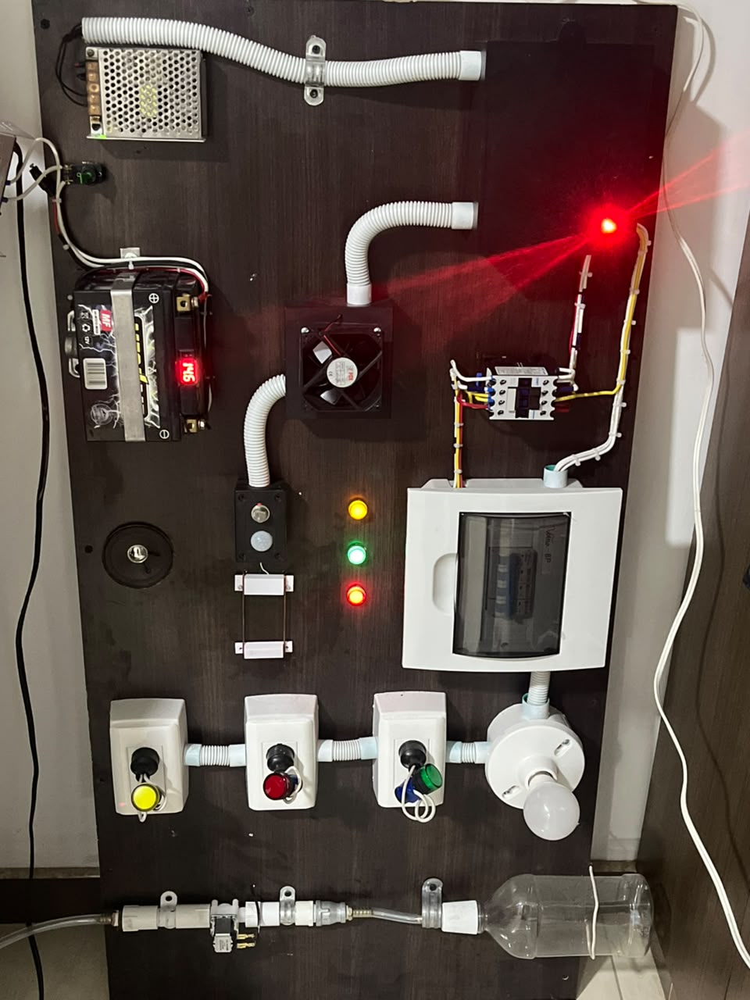
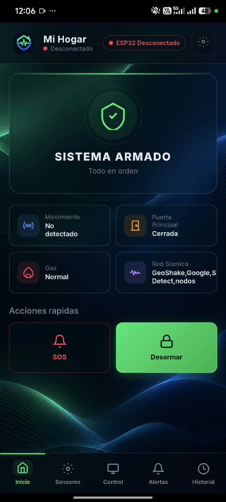
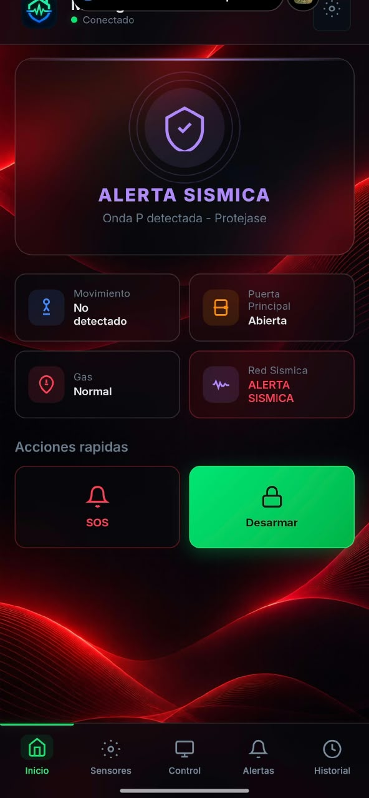
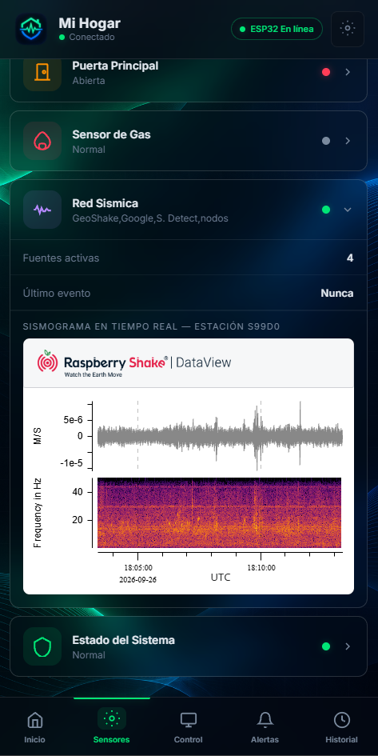
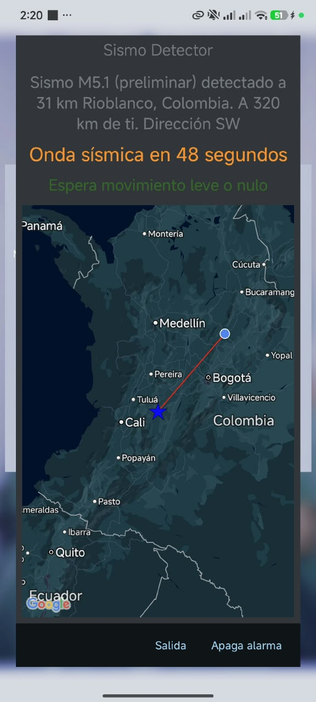
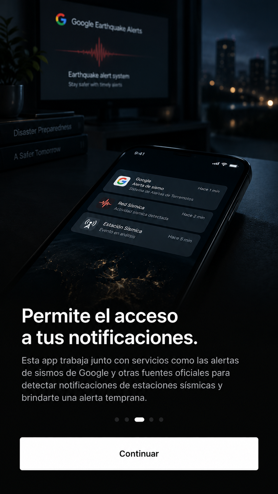
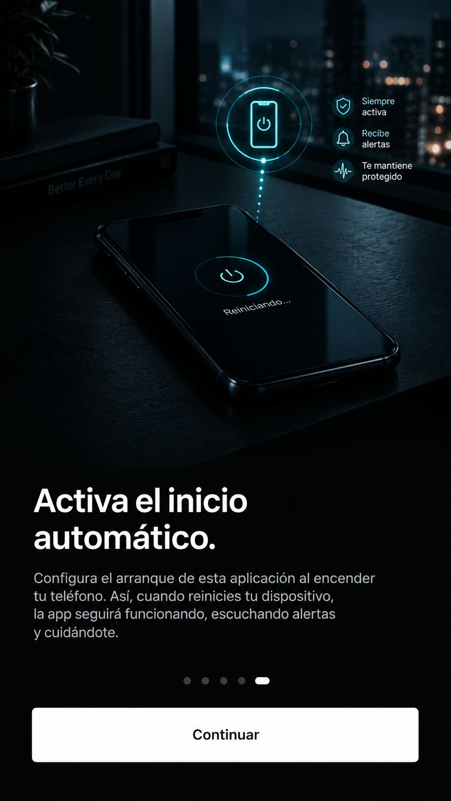

<p align="center">
  
</p>

# SAGE — Smart Alert & Guard Ecosystem

Plataforma de seguridad inteligente para el hogar, basada en **ESP32**, con monitoreo en tiempo real, control remoto de dispositivos, y un módulo de **alerta temprana sísmica** construido combinando múltiples fuentes de detección crowdsourced.

**Autor:** Juan Diego Silva
**Estado:** 🚧 En desarrollo activo

> Este proyecto se conoció durante sus primeras etapas de desarrollo como
> "Hogar Seguro" — el nombre evolucionó a **SAGE** pensando en su
> potencial como marca modular (SAGE Gas, SAGE Energy, SAGE Home, etc.).

---

## 📖 Descripción

SAGE nace como proyecto personal luego de avances con TelegramBotMaster para ESP32, evolucionando hacia una plataforma de seguridad doméstica completa e IoT. Integra:

- **Microcontrolador ESP32** — cerebro del sistema físico (sensores, actuadores)
- **Protocolo MQTT** — comunicación en tiempo real entre todos los componentes
- **App Android nativa** — interfaz de control, puente de alertas sísmicas y servicio nativo de notificaciones que funciona con la app en segundo plano
- **Interfaz web** — panel de control visual, empaquetado también dentro de la app

Uno de los retos más interesantes del proyecto fue diseñar la **alerta temprana de sismos**: ver [`docs/INVESTIGACION.md`](docs/INVESTIGACION.md) para el proceso completo de investigación de fuentes de datos sísmicos en tiempo real (spoiler: la mayoría de fuentes "públicas" resultaron no ser viables, y la solución final combina varias fuentes crowdsourced de forma redundante).

## 🏗️ Arquitectura

Ver [`docs/ARQUITECTURA.md`](docs/ARQUITECTURA.md) para el diagrama completo y la explicación de cada componente.

En resumen:

```
[Sensores físicos] ──┐
                      ├──► ESP32 ──► MQTT (broker.hivemq.com) ◄──► App Android / Web
[Actuadores]  ────────┘                    ▲
                                            │
   Sismo Detector / Google ──► NotificationListener ─┤
   GeoShake (feed MQTT directo) ─────────────────────┤
   RaspberryShake S99D0 ──► sismograma embebido ─► Panel web
```

## 📡 Módulo de alerta sísmica

Este es el componente más investigado del proyecto. En vez de depender de una sola fuente (que resultó no existir de forma pública y en tiempo real para Colombia), el sistema combina **cuatro fuentes redundantes**:

| Fuente | Rol | Cómo se integra |
|---|---|---|
| [Sismo Detector](https://play.google.com/store/apps/details?id=com.finazzi.distquake) (Earthquake Network) | Detección temprana crowdsourced | Notificación → `NotificationListenerService` → MQTT |
| Android Earthquake Alerts (Google) | Confirmación de movimiento inminente/real | Notificación → `NotificationListenerService` → MQTT |
| [GeoShake](https://geoshake.org) | Red abierta de sensores ESP32 | Feed MQTT directo (`geoshake/events`) |
| [RaspberryShake](https://raspberryshake.net) (estación S99D0) | Visualización en panel | Sismograma embebido en la interfaz web |

El módulo fue validado con un **evento sísmico real el 24 de septiembre de 2026**: alerta publicada en el panel y desactivación automática 30 s después.

Ver [`docs/CREDITOS.md`](docs/CREDITOS.md) para el detalle de cada proyecto de terceros utilizado.

## 📸 Capturas

<table>
  <tr>
    <td align="center"><br><sub><b>Prototipo físico</b><br>ESP32 con sensores y actuadores</sub></td>
    <td align="center"><br><sub><b>App Android</b><br>Sistema armado, todo en orden</sub></td>
  </tr>
  <tr>
    <td align="center"><br><sub><b>Alerta sísmica real</b><br>Sismo Detector (fuente del puente): M5.1 a 31 km de Rioblanco, Tolima — 25 sep 2026, 2:20 a. m.</sub></td>
    <td align="center"><br><sub><b>Sismograma en vivo</b><br>Estación S99D0 (RaspberryShake) en el panel de sensores</sub></td>
  </tr>
  <tr>
    <td align="center"><br><sub><b>Tolima, Colombia</b><br>Región donde se sintió el sismo del 25 de septiembre</sub></td>
    <td align="center"><br><sub><b>Onboarding</b><br>Solicitud del permiso de notificaciones</sub></td>
  </tr>
  <tr>
    <td align="center" colspan="2"><br><sub><b>Onboarding</b><br>Asistente de autoinicio (Xiaomi/HyperOS) para mantener el monitoreo activo</sub></td>
  </tr>
</table>

## 📂 Estructura del repositorio

```
sage/
├── assets/                → banner e imágenes de marca
├── app-android/           → App Android (Kotlin): UI + puente de notificaciones sísmicas
├── web-interface/         → Interfaz web (HTML/CSS/JS), empaquetada dentro de la app
├── firmware-esp32/        → Firmware del ESP32 (parcial - ver nota de seguridad abajo)
└── docs/
    ├── ARQUITECTURA.md
    ├── INVESTIGACION.md   → El proceso completo de búsqueda de fuentes sísmicas
    ├── ROADMAP.md
    ├── CREDITOS.md
    └── investigacion-scripts/  → Scripts Python usados durante la investigación
```

## ⚠️ Nota sobre el firmware del ESP32

Por tratarse de un sistema de seguridad física real (control de gas, corriente eléctrica, cerraduras), el firmware completo del ESP32 **no se publica en su totalidad** — se documenta la arquitectura y el enfoque general, pero se omiten detalles específicos de pines, lógica de armado/desarmado y credenciales. Ver [`docs/ROADMAP.md`](docs/ROADMAP.md) para el estado actual.

## 📜 Licencia

Ver [`LICENSE`](LICENSE) — todos los derechos reservados, proyecto compartido con fines de portafolio.
